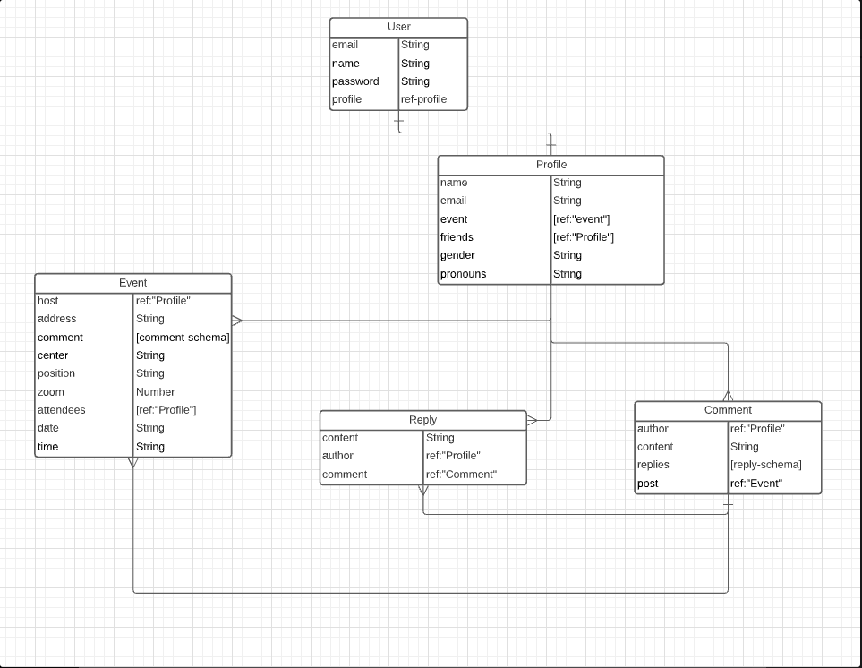
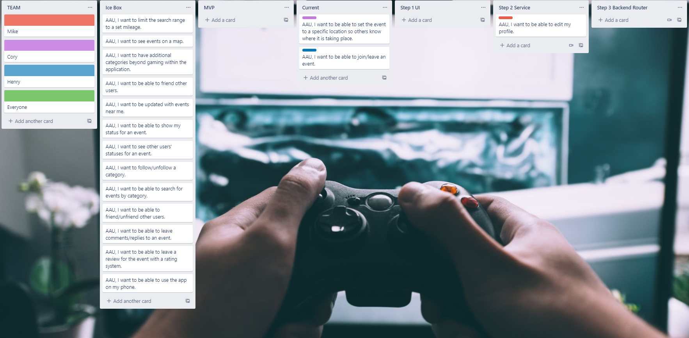
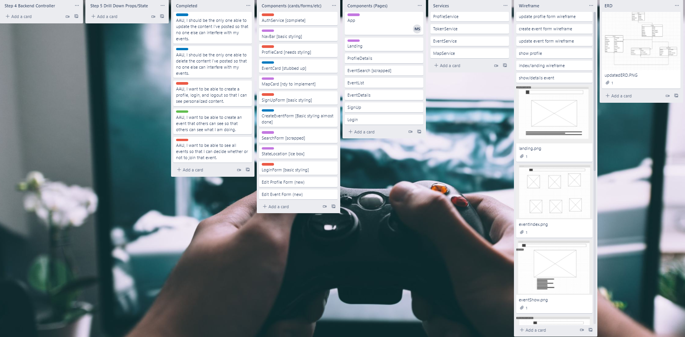
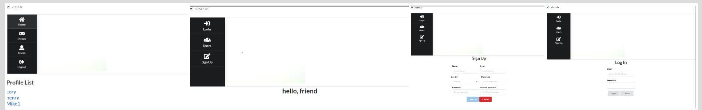

##  Objective:
Creating a MERN stack application.
## Motivation:

## To Checkout the app:
[Click here](https://lfg-project.herokuapp.com/).

## ERD:

## TRELLO BOARD:

## Trello Board Link:
[Trello](https://trello.com/b/Q86Qd1Nj/lfg).

## How it looks now:

## Technology Used:
- React  
- Mongoose
- Mongo DB
- Express.js
- Node.js
- React Google Maps API
- React GeoCoding API
- React GeoLocation API
- Heroku
- GitHub

## Minimum Viable Product:

- AAU, I should be the only one able to update the content I've posted so that no one else can interfere with my events.
- AAU, I should be the only one able to delete the content I've posted so that no one else can interfere with my events.
- AAU, I want to be able to create a profile, login, and logout so that I can see personalized content.
- AAU, I want to be able to create an event that others can see so that others can see what I am doing.
- AAU, I want to be able to see all events so that I can decide whether or not to join that event.

## Stretch Goals:

- [ ] AAU, I want to limit the search range to a set mileage.
- [x] AAU, I want to see events on a map.
- [ ] AAU, I want to have additional categories beyond gaming within the application.
- [ ] AAU, I want to be able to friend other users.
- [ ] AAU, I want to be updated with events near me.
- [ ] AAU, I want to be able to show my status for an event.
- [ ] AAU, I want to see other users' statuses for an event.
- [ ] AAU, I want to follow/unfollow a category.
- [ ] AAU, I want to be able to search for events by category.
- [ ] AAU, I want to be able to friend/unfriend other users.
- [x] AAU, I want to be able to leave comments/replies to an event.
- [ ] AAU, I want to be able to leave a review for the event with a rating system.
- [ ] AAU, I want to be able to use the app on my phone.
